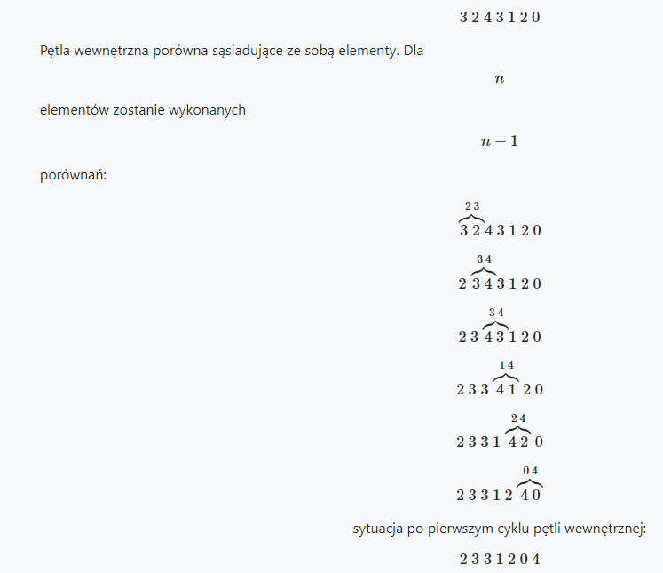

Sortowanie bąbelkowe jest jednym z najprostszych w implementacji algorytmów porządkujących dane. Złożoność tego sposobu sortowania jest rzędu

. 

Oznacza to, że sortowanie bąbelkowe nie poradzi sobie z porządkowaniem większych zbiorów.

Nazwa wzięła się stąd, że dane podczas sortowania - tak jak bąbelki w napoju gazowanym - przemieszczają się ku prawej stronie i układają się w odpowiednim szyku.

Algorytm działa następująco:

w każdym przejściu pętli wewnętrznej porównywane są ze sobą dwie kolejne wartości i w razie potrzemy są zamieniane miejscami. W jednym cyklu pętli wewnętrznej, największa liczba (tak jak bąbelki w napoju gazowanym) w zbiorze będzie się przemieszczała na ostatnią pozycję. W ten sposób otrzymujemy podzbiór częściowo już posortowany. Czynności te powtarzamy dla zbioru pominiętego o elementy już poukładane. Prześledźmy przykład:

posortujemy tą metodą następujące dane

Największa liczba (w tym przypadku

